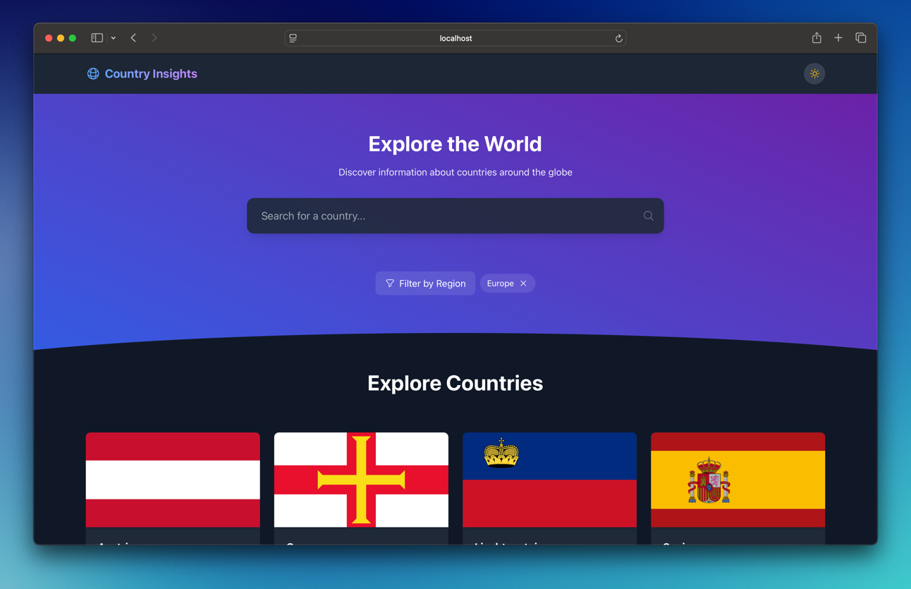

# Country-Insights

<div align="left">
  
</div>


Country Insights is a web application that allows users to explore detailed information about countries around the world. It fetches real-time data using REST APIs to display country-specific details such as population, region, capital, and more. With a clean, responsive interface and intuitive navigation, users can easily search and filter countries to gain quick insights.

## 🚀 Demo Link -> [https://code-qtzl.github.io/Country-Insights/](https://code-qtzl.github.io/Country-Insights/)

## 📸 Screenshots

<div align="center">
  
  <p><em>Dark Mode - Filter by Region</em></p>
</div>

## 🛠️ Installation

1. Clone the repository:

```
git clone https://github.com/code-qtzl/Country-Insights.git
```

2.  Navigate to project directory:

```
cd Country-Insights
```

3. Install dependencies:

```
npm install
```

4. Run development server:

```
npm run dev
```

## 🐳 Docker Setup

This project includes separate Docker configurations for development and production.

### Prerequisites

- Docker
- Docker Compose

### Environment Variables

Create a local environment file before starting the containers:

```
cp .env.example .env
```

Update the values in `.env` as needed:

- `VITE_WEATHER_API_KEY`: OpenWeather API key
- `VITE_MAPS_API_KEY`: Google Maps API key
- `VITE_BASE_URL_COUNTRIES`: Base URL for the countries API

### Development Container

Starts the Vite development server with source files mounted into the container.

```
docker compose -f docker-compose.dev.yml up --build
```

Application URL:

```
http://localhost:5173
```

Stop the development container:

```
docker compose -f docker-compose.dev.yml down
```

### Production Container

Builds the app and serves the static output with Nginx.

```
docker compose up --build
```

Application URL:

```
http://localhost:8080
```

Stop the production container:

```
docker compose down
```

## Main Features:

- Country-related information ([REST Countries](https://restcountries.com/))
- Weather information integration ([Weather API](https://openweathermap.org/api))
- Search functionality
- Theme transition switch light-mode/dark-mode

## Architecture:

- Organized by feature with separate directories for components, hooks, context, and types
- API configuration isolated in config/api.ts
- Custom hooks for data fetching and functionality

## ✉️ Contact

Feel free to reach out for collaborations or questions!
